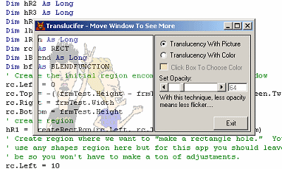

<div align="center">

## Translucifer Translucent Region Demonstration


</div>

### Description

Poor man's translucency. My hope is that other planet users will step up and collaborate with me to make this into a commercial-quality technique, if possible. Maybe it can be. Maybe not. Anyway, I am tired of being told that we can only have translucency on the whole form. I wanted a translucent region and figured out a way it might be done or, at the very least, spawn some ideas from other Planet members that will lead to a commercial quality solution. So, feedback is most vital! This project contains Paul Caton's excellent excellent cSubclass, cTimer, and WinSubHook2.tlb. Thanks again Paul! Hopefully, this will look pretty decent on most of your machines. It looks pretty good and smooth on my Win2K box...just like the screenshot...but I suspect mileage will vary greatly from machine to machine. If you can, compile it into an exe to evaluate it fully. Thanks in advance for any suggestions or feedback!
 
### More Info
 
You should not have to worry but if, for some reason, the reference to the WinSubHook2 .tlb is missing I included it into the zip. You can also get it from Paul Caton's WinSubHook2 submission. In fact, I highly recommend you look at this submission....


<span>             |<span>
---                |---
**Submitted On**   |2004-10-26 14:50:30
**By**             |[AlT](https://github.com/Planet-Source-Code/PSCIndex/blob/master/ByAuthor/alt.md)
**Level**          |Intermediate
**User Rating**    |5.0 (15 globes from 3 users)
**Compatibility**  |VB 6\.0
**Category**       |[Graphics](https://github.com/Planet-Source-Code/PSCIndex/blob/master/ByCategory/graphics__1-46.md)
**World**          |[Visual Basic](https://github.com/Planet-Source-Code/PSCIndex/blob/master/ByWorld/visual-basic.md)
**Archive File**   |[Translucif18106910262004\.zip](https://github.com/Planet-Source-Code/alt-translucifer-translucent-region-demonstration__1-56946/archive/master.zip)

### API Declarations

```
Alphablend
BitBlt
CombineRgn
CreateRectRgn
OffsetRgn
SetWindowRgn
```


